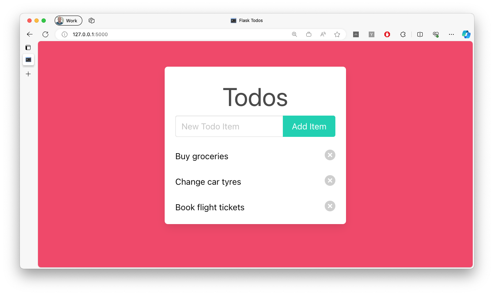

# Flask TODOS

A simple TODO app built with Flask.



## Running

Assuming you've created a virtual env (or not)...

```bash
$ pip install -r requirements.txt
```

Then run the app...

```bash
$ python app.py
```